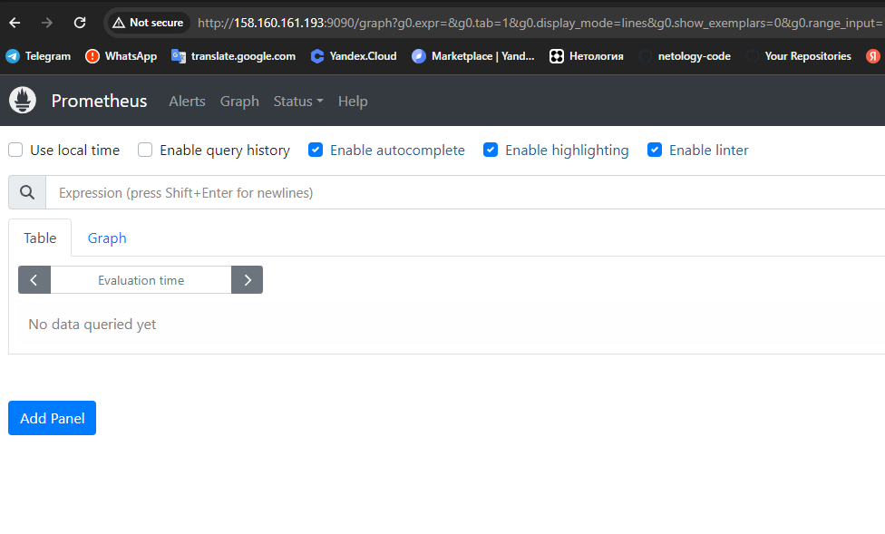

# Пояснтельная записка
## Спецификация файлов проекта
```
.
├── 01-version.tf               # Задает версию провайдера Yandex.Cloud
├── 02-vars.tf                  # Декларирование переменных 
├── 03-providers.tf             # Метаданные для подключения к провайдеру Yandex.Cloud
├── 04.1-personal.auto.tfvars   # Конкретные значения метаданных для подключения к провайдеру Yandex.Cloud
├── 04.2-cloud-init.yaml        # Создает пользователя операционной системы и добавлет ssh ключ
├── 05.1-vpc-subnet.tf          # Описание VPC сети
├── 05.2-vpc-security-group.tf  # Описание security group
├── 05.4-vpc-nat-gateway.tf     # Описание шлюза
├── 05.5-vpc-route-table.tf     # Описание таблицы маршрутизации
├── 06.1-vm-vars.tf             # Описание характеристик виртуальных машин
├── 06.2-vm.tf                  # Создает виртуальныемашины ansible и для кластера kubernetes описанные в 06.1-vm-vars.tf и запускает плейбуки ansible
├── 07-ansible-inventory.tf     # Создает файл инвентори ansible/host.cfg
├── 08.1-lb-target-group.tf     # Создает целевую группу для сетевого балансировщика
├── 08.2-lb.tf                  # Создает сетевой балансировщик и привязывает целевую группу из 08.1-lb-target-group.tf
├── README.md
├── ansible
│   ├── hosts.cfg                                       # Файл инвентори, созданный 07-ansible-inventory.tf
│   ├── kube-deployment.yaml                            # Ansible Playbook развертывает в kubernetes web-приложение deployment.yaml
│   ├── kube-github-install-self-hosted-runner.yaml     # Ansible Playbook устанавлвиает на ВМ ansible self-hosted GitHub runner
│   ├── kube-masters.yaml                               # Ansible Playbook устанавливает на ВМ кластера kubernetes ПО kubeadm, kubelet, конфигурирует окружение
│   ├── kube-monitoring.yaml                            # Ansible Playbook устанавлвиает в кластер kubernetes систему мониторинга grafana, prometheus, altermanager
│   ├── kube-prerequisites.yaml                         # Ansible Playbook устанавлвиает на ВМ кластера kubernetes пререквизиты, необходимые для работы кластера
│   ├── kube-redeployment.yaml                          # Ansible Playbook удаляет и повторно развертывает в kubernetes web-приложение deployment.yaml
│   ├── kube-service.yaml                               # Ansible Playbook создает в кластере kubernetes сервсиы для публикации приложений из внутренней сети кластера
│   └── kube-workers.yaml                               # Ansible Playbook присоединяет worker'ы к кластеру kubernetes    
├── back
│   ├── 05.1-vpc-vars.tf.back
│   ├── 05.3-vpc-security-group.tf.back
│   ├── 05.4-vpc-nat-instance.tf.back
│   └── 05.5-vpc-route-table.tf.back
├── bash
│   ├── commands.sh
│   ├── install-kubernetes.01.sh
│   ├── install-kubernetes.02.sh
│   ├── kube-github-install-self-hosted-runner.sh
│   └── kube-monitoring.sh
├── hosts.tftpl                                         # Шаблон файла инвентори ansible
├── kubernetes
│   ├── deployment.yaml                                 # Манифест развертывания web-приложения
│   └── service.yaml                                    # Манифест развертывания сервисов пуликации приложений из внутренней сети kubernetes
├── output.tf
├── terraform.tfstate
└── terraform.tfstate.backup
```
## Концепция
### Кластер и публикация приложений
Имеется кластер kubernetes, в котором развернуты приложения для мониторинга кластера и web-приложение.
Средства мониторинга и web-приложение опубликованы из сети kubernetes через сервис типа NodePort.
Сервера кластера kubernetes не имеют публичных IP адресов.
Перед кластером kubenetes установлен сетевой балансировщик Yandex.Cloud с целевой группой, состоящей из worker ВМ. Сетевой балансировщик иметт публичный ip адресс.
### Администрирование
Для администрирования используется jump сервер - ВМ ansible с публичным IP адресом.
### Image registry
Исползуется GitHub Image Registry
### CI\CD
Используется GitHub Action.
Для сброки образа web-приложения используется runner GitHub
Для развертывания новой версии web-приложения в кластер kubernetes используется self-hosted runner, который установлен на ВМ ansible

## Стадии создания инфраструктуры
Посредством terrafrom создаются сущности:
- ВМ для кластера kubernetes
- ВМ для администрирования ansible
- Сетевой балансировщик Yandex.Cloud для публикации приложений из кластера kubernetes в сеть интернет
- С помощью дериктивы remote-exeс на ВМ ansible запускаются Playbook'и, которые:
  - настраивают kubernetes кластер
  - устанавливают систему мониторинга и web-приложение
  - устаналивают Github self-hosted runner на ВМ ansible
## Описание CI\CD
В отдельном репозитории https://github.com/pnagibin/diplom-docker настроен процесс CI\CD по условиям push и присвоению тэга типа v1.** начинается:
- сборка образа
- публикация в GitHub Image Registry
- развертывание новой версии в кластер kubernetes
## Описание прицнипа запуска terraform
1. Скачать содержимое репозитория https://github.com/pnagibin/netology-diplom.git
2. Отредактировать файлы с персональными данным к Yandex.Cloud:
   - 04.1-personal.auto.tfvars
   - 04.2-cloud-init.yaml
   - kube-github-install-self-hosted-runner.yaml в строке 13 указать ваш токен для GitHub self-hosted runner
3. Выполнить команды ``` terrafrom plan и terraform apply ```

По итогу выполнения должен будет развернуться кластер kubernetes, система мониторинга и web-приложение, а также настроена публикация через публичный IP адрес сетевого балансировщика приложений:
- http://158.160.161.193:80   # web-приложение
- http://158.160.161.193:3000 # grafana логин\пароль admin\admin
- http://158.160.161.193:9090 # prometheus
- http://158.160.161.193:9093 # alertmanager

## Описание принципа публикации приложения через CI\CD
1. Выполнить необходимые изменения в репозитории https://github.com/pnagibin/diplom-docker
2. На странице репозитория в web-интерфейсе GitHub присвоить новому релизу тэг вида v1.**
3. Начнется процесс автоматической сборки образа и публикации в GitHub Image Registry, данный процесс выполняется на GutHub runner.
4. После успешного завершения процессов сборки нового образа и публикации запустится прцоесс развертывания новой версии web-приложения в кластер kubernetes, данный процесс работает на self-hosted runner, который установлен на ВМ ansible.

## Результаты автоматического развертывания

Инфраструктура в Yandex.Cloud


Карта сети


Балансировщик


CI\CD


## Публикация приложений в сеть интернет

web-приложение


Grafana


Prometheus



Altermanager

